# MRI Brain Extraction and Mesh Generation

A toolset for extracting brain tissue from MRI scans and generating 3D meshes, excluding skull and non-brain tissues.

## Overview

This project provides a Python-based pipeline to:

1. Extract brain tissue from T1-weighted MRI scans
2. Create 3D meshes suitable for visualization, analysis, or 3D printing
3. Eliminate skull and non-brain tissues using boundary detection algorithms

## Requirements

- Python 3.x
- nibabel
- numpy
- trimesh
- scipy
- scikit-image
- matplotlib

```bash
python -m venv mri_env
source mri_env/bin/activate
pip install nibabel matplotlib numpy trimesh scipy scikit-image
```

## Files

- `mri_to_mesh.py` - Main processing script
- `101.nii` - Example T1-weighted MRI scan
- `101_brain_no_skull.stl/obj` - Detailed brain mesh preserving internal structures
- `101_brain_solid.stl/obj` - Solid brain mesh suitable for 3D printing
- Diagnostic images showing the extraction process

## Methodology

The extraction process uses multiple strategies to separate brain tissue from skull:

### 1. Edge Detection and Boundary Analysis

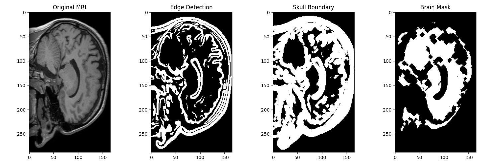

The algorithm identifies the boundary between brain and skull using gradient analysis and intensity thresholding. Red regions in the overlay visualize the detected skull boundary, which guides the extraction:

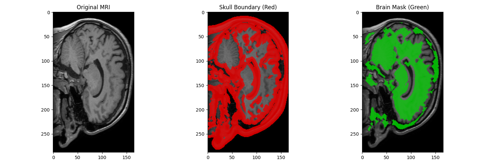

### 2. Multi-Phase Brain Tissue Extraction

Key techniques employed:

- Multi-threshold approach to separate tissue types based on intensity
- Edge detection to identify tissue boundaries
- Morphological operations for region refinement
- Controlled region growth with skull-avoidance constraints

#### Intensity-Based Segmentation

First, we use intensity thresholding to identify potential brain tissue:


#### Boundary-Based Analysis

We then analyze boundaries to differentiate brain from skull:

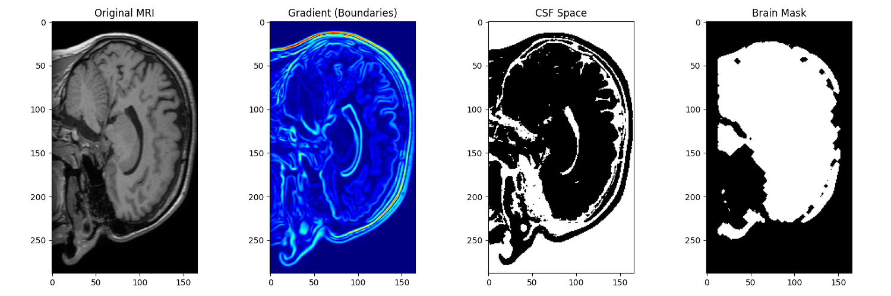

#### Distance-Based Processing

Distance transforms help identify the central brain regions:

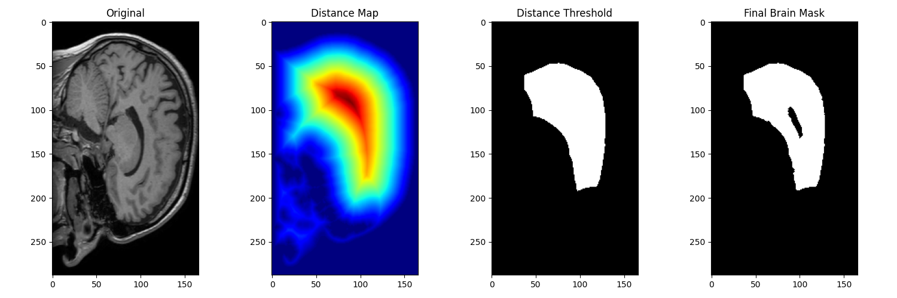

#### Watershed Algorithm Application

Watershed segmentation refines the extraction:

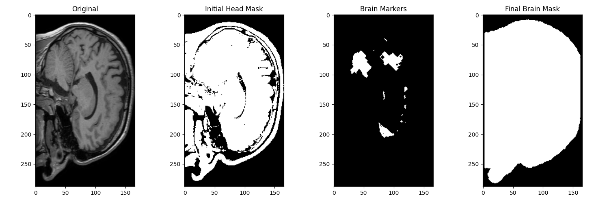

#### Expansion Process

The algorithm iteratively grows a mask from deep brain regions outward, stopping at detected boundaries:

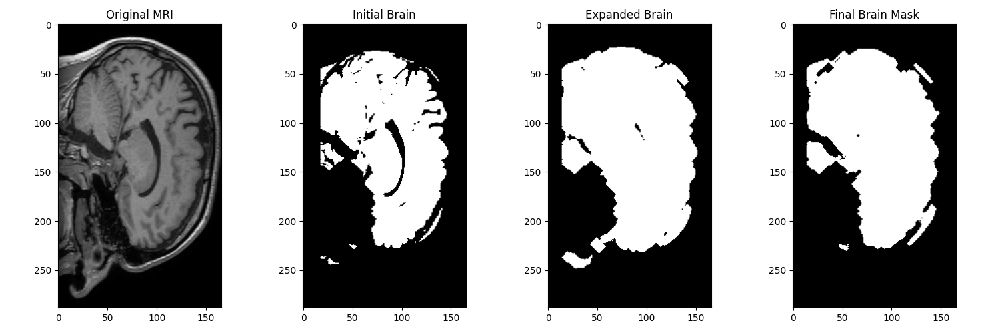
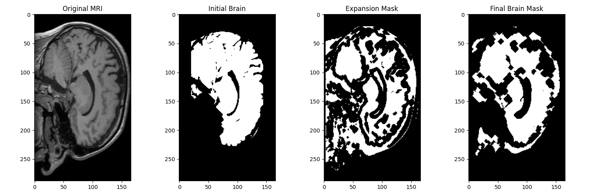

#### Final Extraction

The final brain mask after all processing steps:

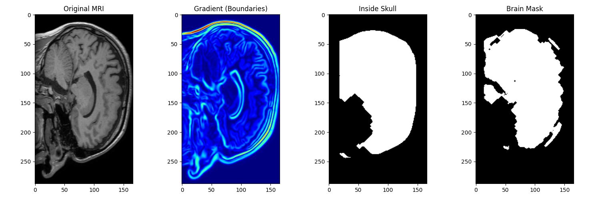

### 3. 3D Mesh Generation

Once a clean brain mask is established, marching cubes algorithm converts the volumetric mask to a surface mesh. Two mesh variants are produced:

- **Detailed mesh** - Preserves internal structures like ventricles
- **Solid mesh** - Uses aggressive hole-filling for a more solid model suitable for 3D printing

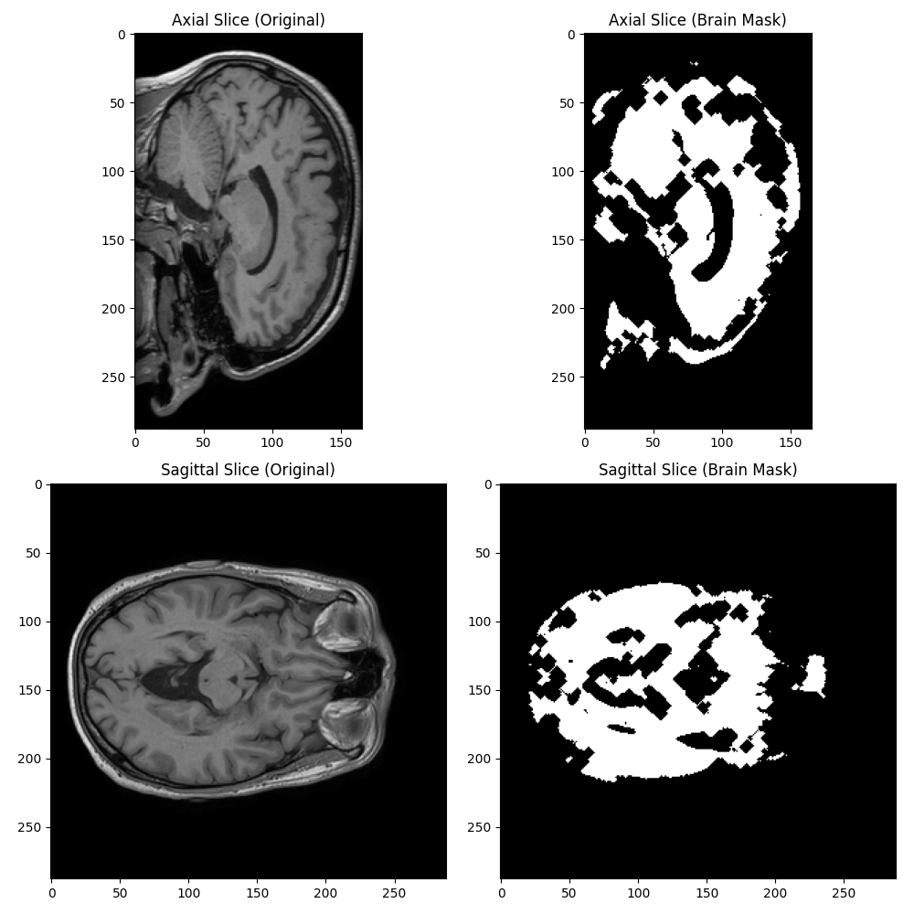

## Results

Two brain mesh representations:

### 1. Detailed Brain Mesh

- Preserves ventricles and internal structures
- 312,645 vertices / 625,730 faces
- Optimal for visualization and analysis

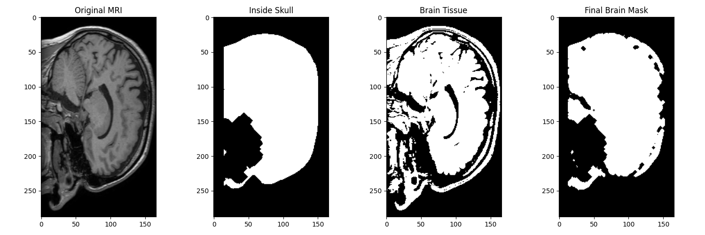

### 2. Solid Brain Mesh

- Filled internal structures for solidity
- 574,284 vertices / 1,150,568 faces
- Suitable for 3D printing

## Best Slices View

The following image shows the best representative slices from the extraction process:

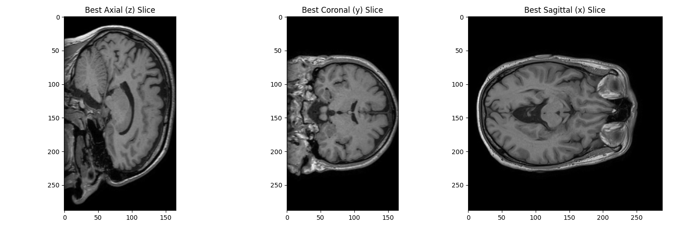

## Usage

```bash
python mri_to_mesh.py
```

To process your own MRI data, modify the script to point to your `.nii` file.

## Future Improvements

- Deep learning-based brain extraction (requires SAM or other segmentation models)
- Multi-tissue segmentation for white/gray matter differentiation
- Mesh refinement and smoothing options
- Configurable parameters via command-line arguments
